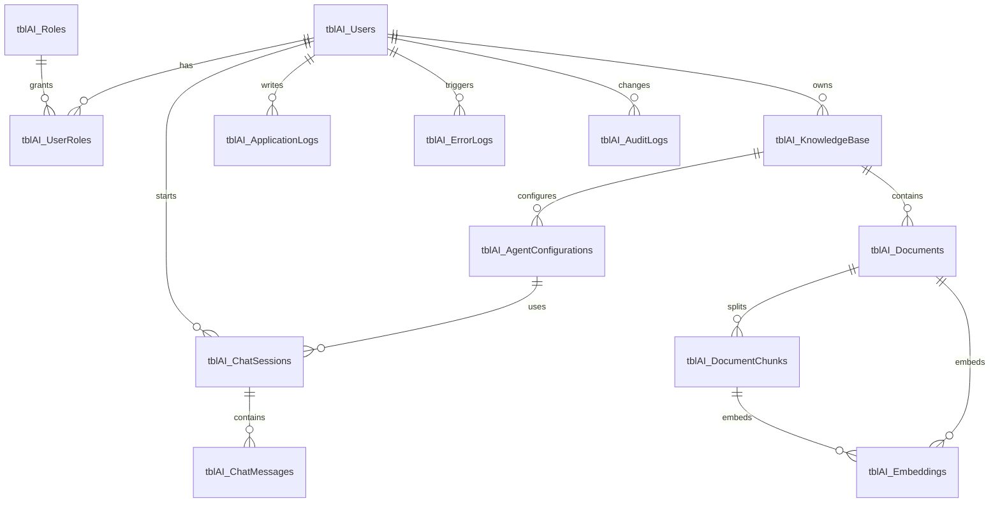

# Ajay_DB Database Design

Target database: `Ajay_DB`  
SQL Server version: SQL Server 2022  
Application path: React UI -> API -> BAL -> DAL -> stored procedures -> SQL Server

## Deployment Order

1. `Scripts/000_CreateDatabase.sql`
2. `Tables/001_CreateTables.sql`
3. `Scripts/010_AlterTables_AuditSoftDelete.sql`
4. `Constraints/001_Constraints.sql`
5. `Functions/001_Functions.sql`
6. `Views/001_Views.sql`
7. `StoredProcedures/001_AgenticKnowledgeAssistantStoredProcedures.sql`
8. `Indexes/001_IndexRecommendations.sql`
9. `Scripts/999_OptimizationRecommendations.sql`

`Scripts/900_Deploy_Ajay_DB.sql` can run the full deployment in SQLCMD mode.

## Tables

| Table | Purpose | Primary Key | Foreign Keys | Main Indexes | Stored Procedures |
|---|---|---|---|---|---|
| `tblAI_Users` | Application users for JWT/authentication ownership. | `PK_tblAI_Users` | None | `IX_tblAI_Users_Email`, `IX_tblAI_Users_UserName` | `usp_AI_InsertUser`, `usp_AI_GetUserById`, `usp_AI_GetUserByEmail`, `usp_AI_UpdateUser`, `usp_AI_DeleteUser` |
| `tblAI_Roles` | Role catalog. | `PK_tblAI_Roles` | None | `UQ_tblAI_Roles_RoleName` | `usp_AI_InsertRole`, `usp_AI_GetRoles`, `usp_AI_UpdateRole`, `usp_AI_DeleteRole` |
| `tblAI_UserRoles` | Many-to-many user/role mapping. | `PK_tblAI_UserRoles` | `FK_tblAI_UserRoles_tblAI_Users`, `FK_tblAI_UserRoles_tblAI_Roles` | `IX_tblAI_UserRoles_UserId`, `UQ_tblAI_UserRoles_UserId_RoleId` | `usp_AI_InsertUserRole`, `usp_AI_DeleteUserRole` |
| `tblAI_KnowledgeBase` | Logical grouping for document collections. | `PK_tblAI_KnowledgeBase` | `FK_tblAI_KnowledgeBase_tblAI_Users` | `IX_tblAI_KnowledgeBase_IsActive` | `usp_AI_SaveKnowledgeBase`, `usp_AI_GetKnowledgeBase`, `usp_AI_DeleteKnowledgeBase` |
| `tblAI_AgentConfigurations` | Agent model, prompt, and retrieval settings. | `PK_tblAI_AgentConfigurations` | `FK_tblAI_AgentConfigurations_tblAI_KnowledgeBase` | `IX_tblAI_AgentConfigurations_IsDefault` | `usp_AI_SaveAgentConfiguration`, `usp_AI_GetDefaultAgentConfiguration`, `usp_AI_GetAgentConfigurations`, `usp_AI_DeleteAgentConfiguration` |
| `tblAI_ChatSessions` | Conversation header/session records. | `PK_tblAI_ChatSessions` | `FK_tblAI_ChatSessions_tblAI_Users`, `FK_tblAI_ChatSessions_tblAI_AgentConfigurations` | `IX_tblAI_ChatSessions_UserId` | `usp_AI_InsertChatSession`, `usp_AI_GetChatSessions`, `usp_AI_DeleteChatSession` |
| `tblAI_ChatMessages` | User questions and assistant responses. | `PK_tblAI_ChatMessages` | `FK_tblAI_ChatMessages_tblAI_ChatSessions`, `FK_tblAI_ChatMessages_tblAI_Users` | `IX_tblAI_ChatMessages_SessionId`, `IX_tblAI_ChatMessages_CreatedDate` | `usp_AI_SaveChatMessage`, `usp_AI_GetChatMessages`, `usp_AI_SaveChatHistory`, `usp_AI_GetChatHistory` |
| `tblAI_Documents` | Uploaded source documents and extracted text. | `PK_tblAI_Documents` | `FK_tblAI_Documents_tblAI_KnowledgeBase` | `IX_tblAI_Documents_KnowledgeBaseId`, optional full-text index | `usp_AI_UploadDocument`, `usp_AI_UpdateDocument`, `usp_AI_GetDocumentById`, `usp_AI_GetDocuments`, `usp_AI_GetDocumentsByIds`, `usp_AI_SearchDocuments`, `usp_AI_DeleteDocument` |
| `tblAI_DocumentChunks` | Chunked document text for retrieval. | `PK_tblAI_DocumentChunks` | `FK_tblAI_DocumentChunks_tblAI_Documents` | `IX_tblAI_DocumentChunks_DocumentId` | `usp_AI_InsertDocumentChunk`, `usp_AI_GetDocumentChunks`, `usp_AI_DeleteDocumentChunk` |
| `tblAI_Embeddings` | Serialized embedding vectors for documents/chunks. | `PK_tblAI_Embeddings` | `FK_tblAI_Embeddings_tblAI_Documents`, `FK_tblAI_Embeddings_tblAI_DocumentChunks` | `IX_tblAI_Embeddings_DocumentId`, `IX_tblAI_Embeddings_DocumentChunkId` | `usp_AI_InsertEmbedding`, `usp_AI_GetEmbeddings`, `usp_AI_DeleteEmbedding` |
| `tblAI_ApplicationLogs` | Structured application log events. | `PK_tblAI_ApplicationLogs` | `FK_tblAI_ApplicationLogs_tblAI_Users` | `IX_tblAI_ApplicationLogs_CreatedDate` | `usp_AI_LogApplication`, `usp_AI_GetApplicationLogs` |
| `tblAI_ErrorLogs` | Exception/error diagnostics. | `PK_tblAI_ErrorLogs` | `FK_tblAI_ErrorLogs_tblAI_Users` | `IX_tblAI_ErrorLogs_CreatedDate` | `usp_AI_LogError`, `usp_AI_GetErrorLogs`, `usp_AI_MarkErrorResolved` |
| `tblAI_AuditLogs` | Entity change audit events. | `PK_tblAI_AuditLogs` | `FK_tblAI_AuditLogs_tblAI_Users` | `IX_tblAI_AuditLogs_TableName` | `usp_AI_LogAudit` |

## Common Columns

Operational tables include:

- `CreatedDate DATETIME2(3)`
- `ModifiedDate DATETIME2(3)`
- `CreatedBy INT`
- `ModifiedBy INT`
- `IsActive BIT`
- `IsDeleted BIT`
- `RowVersion ROWVERSION`

Every table includes the mandatory audit columns: `CreatedBy`, `CreatedDate`, `ModifiedBy`, `ModifiedDate`, `IsActive`, and `IsDeleted`.

## Relationships

## Partitioning Strategy

For production growth, partition append-heavy tables by `CreatedDate` monthly:

- `tblAI_ChatMessages`
- `tblAI_ApplicationLogs`
- `tblAI_ErrorLogs`
- `tblAI_AuditLogs`

Keep the current clustered primary keys for OLTP inserts. Add a partition function/scheme only when data volume reaches operational need, typically after tens of millions of rows or when retention windows require fast sliding-window archival.

## Security Notes

- Store password hashes only, never plain text.
- Grant application users execute permission on `usp_AI_%` procedures, not direct table writes.
- Restrict log table access because logs may contain request metadata.
- Enable Transparent Data Encryption and encrypted backups in production.
