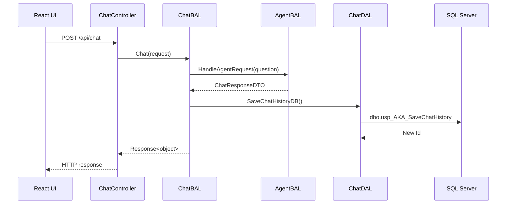
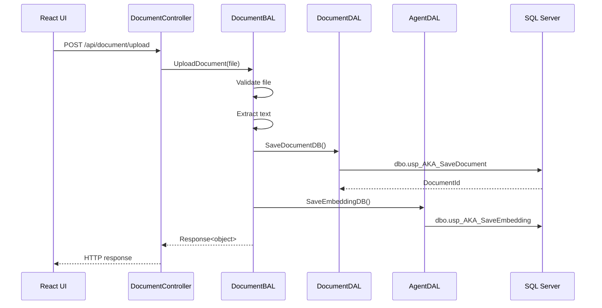

# Agentic Knowledge Assistant API Documentation

## API Pattern

The API follows the same pattern as `RDLCApi.Revalweb.com`:

```text
Controller -> BAL -> DAL -> SQL Server Stored Procedure -> Response<object>
```

Controllers use `api/[action]` routes and also keep compatibility routes for the React UI.

## Response Wrapper

All main business APIs return:

```json
{
  "ReturnCode": 200,
  "ReturnMessage": "success",
  "ResponseTime": "12",
  "Data": {}
}
```

DTO location:

```text
src/AgenticKnowledgeAssistant.DTO/CommonDTOs/Response.cs
```

## API Endpoints

| Controller | Action | Compatibility Route | HTTP | BAL Method | DAL Methods | SQL Objects |
|---|---|---|---|---|---|---|
| AuthController | `/api/Token` | `/api/auth/token` | POST | JWT service | None | None |
| ChatController | `/api/Chat` | `/api/chat` | POST | `ChatBAL.Chat` | `ChatDAL.SaveChatHistoryDB`, agent/document DAL as needed | `usp_AKA_SaveChatHistory`, `usp_AKA_GetEmbeddings`, `usp_AKA_GetDocumentsByIds` |
| ChatController | `/api/ChatHealth` | `/api/chat/health` | GET | None | None | None |
| DocumentController | `/api/UploadDocument` | `/api/document/upload` | POST | `DocumentBAL.UploadDocument` | `DocumentDAL.SaveDocumentDB`, `AgentDAL.SaveEmbeddingDB` | `usp_AKA_SaveDocument`, `usp_AKA_SaveEmbedding` |
| DocumentController | `/api/GetDocuments` | `/api/document` | GET | `DocumentBAL.GetDocuments` | `DocumentDAL.GetDocumentsDB` | `usp_AKA_GetDocuments` |
| DocumentController | `/api/SearchDocuments?q=value` | `/api/document/search?q=value` | GET | `DocumentBAL.SearchDocuments` | `DocumentDAL.SearchDocumentsDB` | `usp_AKA_SearchDocuments` |
| DocumentController | `/api/DeleteDocument?id=1` | `/api/document/{id}` | DELETE | `DocumentBAL.DeleteDocument` | `DocumentDAL.DeleteDocumentDB` | `usp_AKA_DeleteDocument` |
| DocumentController | `/api/DocumentHealth` | `/api/document/health` | GET | None | None | None |
| StatusController | `/api/Status` | `/api/status` | GET | None | None | None |
| StatusController | `/api/Health` | `/api/health` | GET | None | None | None |
| ToolsController | `/api/GetCurrentDate` | `/api/tools/date` | GET | None | None | None |
| ToolsController | `/api/SearchFiles?query=value` | `/api/tools/search-files?query=value` | GET | None | None | None |
| ToolsController | `/api/SearchDatabase?query=value` | `/api/tools/search-database?query=value` | GET | None | None | None |
| ToolsController | `/api/ToolsHealth` | `/api/tools/health` | GET | None | None | None |

## Chat Flow



## Document Upload Flow



## Security and Middleware

- JWT authentication configured in `Program.cs`.
- Rate limiting configured in `Program.cs`.
- Serilog configured from `appsettings.json`.
- Global exception middleware: `GlobalExceptionMiddleware`.
- Security headers middleware: `ResponseHeadersMiddleware`.
- Buffered request logging: `BufferedCodeLogger` and `BufferedLoggerFlushMiddleware`.

## SQL Scripts

SQL Server deployment scripts are in:

```text
Database/Scripts
Database/Tables
Database/StoredProcedures
Database/Indexes
```
