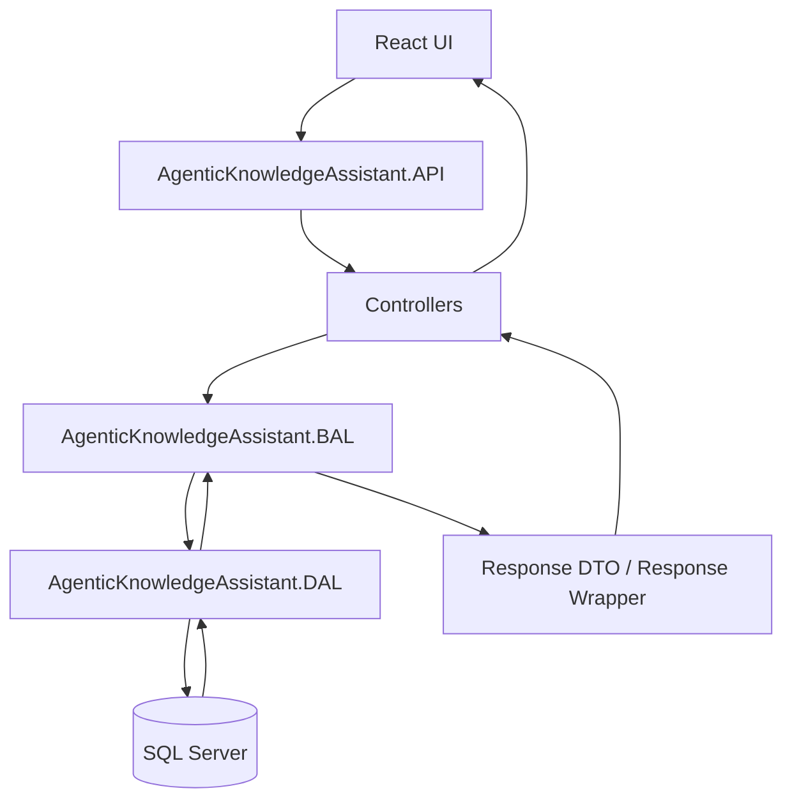
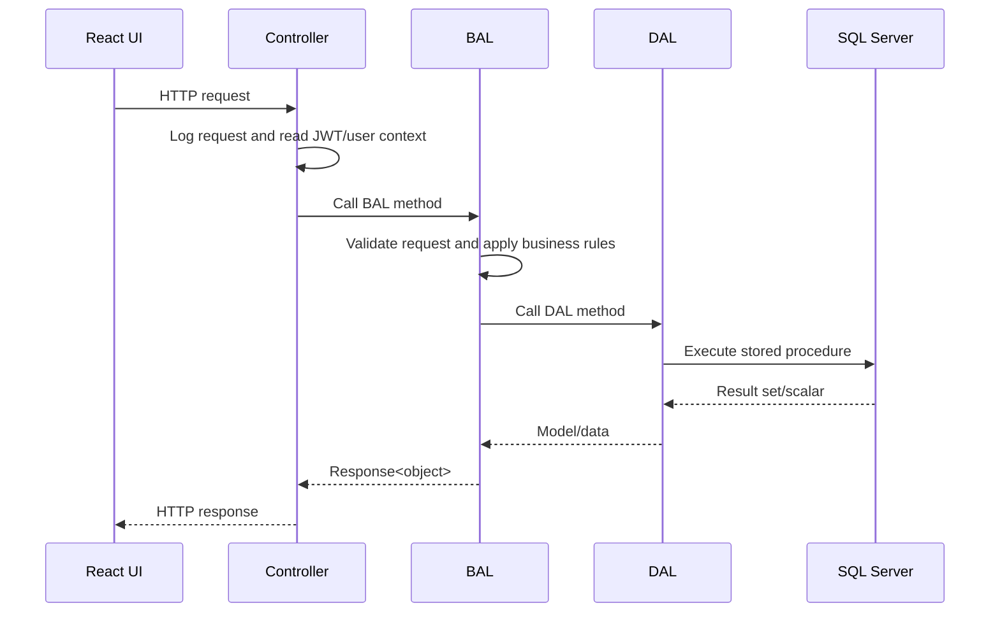

# Agentic Knowledge Assistant Architecture

The solution now follows the same layered organization style as `RDLCApi.Revalweb.com`: API controllers call BAL classes, BAL applies validation/business rules, DAL executes SQL Server stored procedures, and all responses return through a common wrapper.

## Complete Solution Structure

```text
AgenticKnowledgeAssistant.sln
src/
  AgenticKnowledgeAssistant.API/
    Controllers/
    Filters/
    Middleware/
    Extensions/
    Hubs/
    Services/
    Program.cs
    appsettings.json
  AgenticKnowledgeAssistant.BAL/
    CommonBAL.cs
    AgentBAL.cs
    ChatBAL.cs
    DocumentBAL.cs
    Interfaces/
  AgenticKnowledgeAssistant.DAL/
    CommonDAL.cs
    AgentDAL.cs
    ChatDAL.cs
    DocumentDAL.cs
    Interfaces/
  AgenticKnowledgeAssistant.DTO/
    Models/
    RequestDTOs/
    ResponseDTOs/
    CommonDTOs/
  AgenticKnowledgeAssistant.Common/
    Helpers/
    Logger/
    JWT/
    Extensions/
    Constants/
  AgenticKnowledgeAssistant.Security/
    Authentication/
    Authorization/
    Encryption/
Database/
  Scripts/
  Tables/
  StoredProcedures/
  Indexes/
```

## Project References

```text
AgenticKnowledgeAssistant.API
  -> AgenticKnowledgeAssistant.BAL
  -> AgenticKnowledgeAssistant.DAL
  -> AgenticKnowledgeAssistant.DTO
  -> AgenticKnowledgeAssistant.Common
  -> AgenticKnowledgeAssistant.Security

AgenticKnowledgeAssistant.BAL
  -> AgenticKnowledgeAssistant.DAL
  -> AgenticKnowledgeAssistant.DTO
  -> AgenticKnowledgeAssistant.Common

AgenticKnowledgeAssistant.DAL
  -> AgenticKnowledgeAssistant.DTO

AgenticKnowledgeAssistant.Common
  -> AgenticKnowledgeAssistant.DTO
```

## Naming Pattern

| Layer | Pattern | Examples |
|---|---|---|
| API | `*Controller.cs` | `ChatController`, `DocumentController` |
| BAL | `*BAL.cs` | `ChatBAL`, `DocumentBAL`, `AgentBAL`, `CommonBAL` |
| DAL | `*DAL.cs` | `ChatDAL`, `DocumentDAL`, `AgentDAL`, `CommonDAL` |
| DTO | `*DTO.cs`, `*Model.cs` | `ChatRequestDTO`, `DocumentSummaryDTO`, `DocumentModel` |
| Wrapper | `Response<T>` | `Response<object>` |

## Architecture Diagram



## Request Flow



## Dependency Injection Pattern

DI is centralized in:

```text
src/AgenticKnowledgeAssistant.API/Extensions/ServiceCollectionExtensions.cs
```

It registers:

- Middleware
- BAL interfaces/classes
- DAL interfaces/classes
- JWT token service
- User context service
- Buffered request logger

## Configuration Pattern

`Program.cs` binds:

```json
"AppSettings": {
  "DefaultConnection": "...",
  "OpenAIEndpoint": "https://api.openai.com",
  "OpenAIApiKey": "...",
  "JWT_Secret": "...",
  "APIRateLimit": 120,
  "APIRateLimitSeconds": 60
}
```

## SQL Server Pattern

DAL classes call stored procedures via ADO.NET:

- `DocumentDAL.SaveDocumentDB` -> `dbo.usp_AKA_SaveDocument`
- `DocumentDAL.GetDocumentsDB` -> `dbo.usp_AKA_GetDocuments`
- `DocumentDAL.SearchDocumentsDB` -> `dbo.usp_AKA_SearchDocuments`
- `ChatDAL.SaveChatHistoryDB` -> `dbo.usp_AKA_SaveChatHistory`
- `AgentDAL.SaveEmbeddingDB` -> `dbo.usp_AKA_SaveEmbedding`

SQL assets are in `Database/`.
